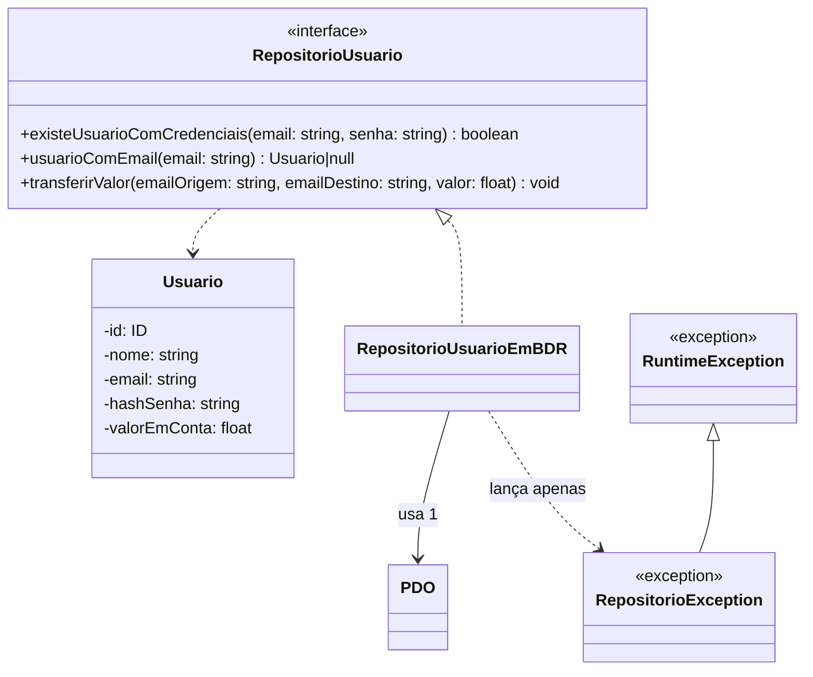

# Programação para a Web - Prova 2 - 2021/1

**Instituição:** Centro Federal de Educação Tecnológica - Unidade Nova Friburgo  
**Curso:** Bacharelado em Sistemas de Informação  
**Professor:** Thiago Delgado Pinto  
**Nota:** até 10,0

**Data:** ____________________  
**Aluno(a):** ______________________________________________________________

## Orientações

Para todas as questões, utilize:

- PHP 5 a 7, sem uso de bibliotecas de código externas;
- formato UTF-8 em todos os arquivos, *strings*, entradas e saídas.

> **Atenção: devem ser entregues:**
>
> - arquivos de código em PHP;
> - arquivos de código SQL, como os que contiverem inserções realizadas no banco de dados.

## Introdução

A startup DoeMais pretende construir uma solução especializada em doações entre pessoas cadastradas no próprio site como usuários. A ideia é que essas pessoas possam transferir dinheiro, via Pix, de suas contas pessoais para a conta da empresa, e ela automaticamente disponibilize 98% do valor, em forma da moeda digital Deeme (DM) - que sempre tem cotação de 1 para 1 com o Real -, para o usuário.

Logo, se uma pessoa transferir R$ 100,00 via Pix para a DoeMais, ela terá DM 98,00 - 98 deemes - disponíveis em sua conta para doar para outros usuários da plataforma.

Para ajudar a construir a primeira versão da plataforma, a DoeMais contratou você, desenvolvedor(a) PHP. Você ficou incumbido(a) de desenvolver partes da API RESTful da plataforma, responsáveis pela gestão de doações, *login* e *logout*. A transformação de Reais para Deemes não será atribuição sua.

Cada uma das funcionalidades da API deve ser implementada utilizando boas práticas de segurança, tais como proteções contra ataques XSS, roubos de *cookies*, roubos de sessões e injeções de *scripts* - JavaScript, SQL ou outro. Assim como todos da equipe, você também deve utilizar o modelo de responsabilidades Model-View-Controller (MVC) para implementá-las.

### Diagrama de classes do modelo



Os tipos `Usuario`, `RepositorioUsuario` e `RepositorioException` já são fornecidos com a prova e devem ser utilizados.

A persistência dos dados deve ocorrer através de repositórios - abstrações no padrão de persistência Repositório. Cada repositório deve usar PDO para manipular o banco de dados MySQL `doemais`, cuja definição se encontra no Apêndice 1.

Uma única conexão com o banco de dados deve ser utilizada para todo o sistema. Deve-se utilizar controle de transação quando necessário. Senhas de usuários devem ser armazenadas utilizando *hash* SHA-256 com sal. O sal não pode ser nenhum utilizado em exercícios anteriores da disciplina. Insira pelo menos dois usuários.

## Tabela 1 - API

| URL | Observação | Métodos permitidos |
|---|---|---|
| `/api/usuarios/atual` |  | `POST` |
| `/api/usuarios/atual` |  | `DELETE` |
| `/api/usuarios/atual/chave-doacao` |  | `GET` |
| `/api/doar-para/<email>` | `<email>` representa um e-mail válido qualquer, como `ana@exemplo.com` | `POST` |

Deve-se responder com o código de status HTTP mais apropriado para cada caso, incluindo:

1. quando a URL requisitada não constar na API;
2. quando o método não for permitido para uma URL existente.

## Questão 1 - 2,0 pontos

Crie na API o *login* de usuário, que possibilite a um usuário cadastrado ter acesso a outros endereços da API durante sua sessão.

Para realizar o *login*, deve ocorrer uma requisição `POST` para `/api/usuarios/atual`, enviando no corpo da requisição, em formato JSON (`application/json`), os campos `email` e `senha`.

Exemplo:

```json
{ "email": "alice@exemplo.com", "senha": "123456" }
```

A senha do usuário deve ser transformada em *hash* SHA-256 com sal antes de ser comparada, uma vez que as senhas dos usuários devem ser armazenadas nesse formato, conforme a introdução.

## Questão 2 - 1,5 ponto

Crie na API o *logout* de usuário, que remova o acesso do usuário a outros endereços da API durante sua sessão.

Para realizar o *logout*, deve ocorrer uma requisição `DELETE` para `/api/usuarios/atual`.

## Questão 3 - 2,0 pontos

Crie na API a obtenção da chave de doação, que obtenha uma chave alfanumérica necessária para realizar uma doação.

Para isso, deve ocorrer uma requisição `GET` para `/api/usuarios/atual/chave-doacao`. O corpo da resposta deve ser vazio e deve ser produzido um *cookie* de nome `doacao`, contendo a chave como valor e com um tempo de expiração de 7 minutos.

Uma chave é produzida pela função abaixo, do arquivo `chave-doacao.php`:

```php
<?php
function gerarChaveDoacao() {
    return bin2hex( random_bytes( 10 ) ); // 20 caracteres
}
?>
```

A chave produzida deve ser guardada na sessão em `ultimaChaveDoacao`. Do contrário, a doação não poderá ser realizada.

## Questão 4 - 3,0 pontos

Crie na API a doação entre usuários, que possibilite a um usuário logado doar um montante disponível de Deemes para outro usuário.

Para isso, deve ocorrer uma requisição `POST` para `/api/doar-para/<email>`, em que `<email>` é o e-mail do usuário destinatário da transferência.

No corpo da requisição, deve ser enviado, em formato de URL codificada (`application/x-www-form-urlencoded`), o parâmetro `valor`. O valor deve ser um *float* maior ou igual a um centavo. Caso contrário, a doação não deve ocorrer e uma mensagem indicando o problema deve ser enviada como resposta, com o status HTTP apropriado.

A transferência deve ser realizada somente caso:

1. tenha sido enviado um *cookie* `doacao`;
2. exista `ultimaChaveDoacao` na sessão;
3. o valor seja um número maior ou igual a um centavo;
4. o e-mail do destinatário exista;
5. o usuário atual tenha disponível em sua conta o montante que deseja transferir;
6. o valor do *cookie* `doacao` seja igual ao armazenado na sessão em `ultimaChaveDoacao`.

Do contrário, o usuário deve receber uma resposta de erro apropriada, que ajude a entender que houve um problema, mas sem expor detalhes de segurança.

Para ser realizada, a transferência deve debitar o valor da conta do usuário atual e creditá-lo na conta do usuário de destino. Ao ser concluída, deve-se sobrescrever o *cookie* `doacao` com valor vazio (`""`) e expiração negativa, além de remover `ultimaChaveDoacao` da sessão.

## Questão 5 - 1,5 ponto

Quando um navegador habilitado para verificar o compartilhamento de recursos de mesma origem - Common Origin Resource Sharing (CORS) - precisa disparar uma requisição HTTP para o servidor de um site, ele pode precisar consultá-lo antecipadamente, disparando uma requisição HTTP prévia, visando verificar se o servidor permite a requisição original.

Essa requisição antecipada é chamada de *preflight* - "pré-voo". O navegador a faz através de uma requisição `OPTION` para a mesma URL desejada, incluindo o cabeçalho `Access-Control-Request-Method`, que indica o método HTTP originalmente desejado para a requisição, como `POST`. O servidor deve, então, responder ao *preflight*. Do contrário, o navegador não realizará a requisição originalmente desejada.

Para realizar a resposta ao *preflight*, o servidor deve responder ao `OPTION` com status `200 OK` e incluir os seguintes cabeçalhos:

1. `Access-Control-Allow-Origin`, que define o domínio a ser confiado, podendo ser o próprio ou externos. Por exemplo, `http://localhost`, em caso de execução em um servidor local;
2. `Access-Control-Allow-Methods`, que define os métodos HTTP permitidos para a URL requisitada, como `GET, POST`, caso queira permitir apenas esses dois métodos.

Considere a existência do arquivo `servidor.php`, com o seguinte conteúdo:

```php
<?php
const SERVIDOR_ORIGEM = 'http://localhost';
?>
```

Construa respostas para requisições *preflight* identificadas na Tabela 1, definindo como origem permitida aquela obtida pela constante do arquivo `servidor.php`.

Como o tratamento dessas requisições é relativo à segurança específica da tecnologia utilizada para entrada de dados, sua implementação deve ser realizada nos artefatos do sistema com essa responsabilidade, segundo o Model-View-Controller (MVC).

**Boa prova!**

---

# Apêndice 1

Listagem do banco de dados MySQL `doemais`, disponível em `localhost`, com usuário `root` e senha vazia.

> **Atenção:**
>
> 1. Insira pelo menos dois usuários e entregue os comandos SQL de inserção junto com a prova, em um arquivo `inserido.sql`.
> 2. Os *hashes* SHA-256 com sal das senhas devem ser gerados por você, com a função PHP criada por você para isso, assim como feito em aula.

```sql
CREATE DATABASE IF NOT EXISTS `doemais` DEFAULT CHARACTER SET utf8 COLLATE utf8_unicode_ci;
USE `doemais`;

CREATE TABLE IF NOT EXISTS `usuario` (
  `id` int(11) NOT NULL AUTO_INCREMENT,
  `nome` varchar(100) COLLATE utf8_unicode_ci NOT NULL,
  `email` varchar(60) COLLATE utf8_unicode_ci NOT NULL,
  `hash_senha` char(64) COLLATE utf8_unicode_ci NOT NULL,
  `valor_em_conta` decimal(10,2) DEFAULT NULL,
  PRIMARY KEY (`id`)
) ENGINE=InnoDB DEFAULT CHARSET=utf8 COLLATE=utf8_unicode_ci;

COMMIT;
```

# Apêndice 2

## Funções do PHP que podem ser úteis

> Algumas funções foram simplificadas; explicação não será fornecida.

```php
checkdate(int $mes, int $dia, int $ano): bool;
isset(mixed $var [, mixed $...]): bool;
unset(mixed $var): void;
count(array $array): int;
in_array(mixed $valor, array $array [, bool $checarTipos]): bool;
array_search(mixed $valor, array $array, bool $strict = false): int|bool;
array_push(array &$array, mixed $value1 [, mixed $value2], ...): int;
empty(string|array $valor): bool;
mb_strtolower(string $texto, string $codificacao = null): string;
mb_strtoupper(string $texto, string $codificacao = null): string;
mb_strlen(string $texto): int;
mb_strpos(string $texto, string $busca [, int $inicio]): int;
mb_substr(string $texto, int $inicio [, int $tamanho]): string;
str_replace(mixed $busca, mixed $substituto, mixed $texto [, int &$modificacoesRealizadas]): mixed;
trim(string $texto [, string $caracteresARetirar]): string;
explode(string $delimitador, string $texto [, int $limite]): array;
implode(string $delimitador, array $a): string;
is_numeric(mixed $var): bool;
readline(string|null $prompt = null): string|false;
preg_match(string $expressao, string $valor [, array &$casamentos [, int $flags = 0 [, int $offset = 0]]]): int;
dirname(string $path): string;
getallheaders(): array;
file_get_contents(string $filename): string|false;
mb_parse_str(string $conteudo, array &$array): void;
htmlspecialchars(string $string, int $flags = ENT_QUOTES | ENT_SUBSTITUTE, ?string $encoding = null): string;
http_response_code(int $code): bool;
header(string $value): void;
json_encode(mixed $value): string|false;
json_decode(string $value): mixed;
time(): int;
setcookie(
    string $name,
    string $value = "",
    int $expires = 0,
    string $path = "",
    string $domain = "",
    bool $secure = false,
    bool $httponly = false
): bool;
session_name(string $name = null): string|bool;
session_set_cookie_params(
    int $lifetime_or_options,
    ?string $path = null,
    ?string $domain = null,
    ?bool $secure = null,
    ?bool $httponly = null
): bool;
session_start(): bool;
session_unset(): bool;
session_destroy(): bool;
```
